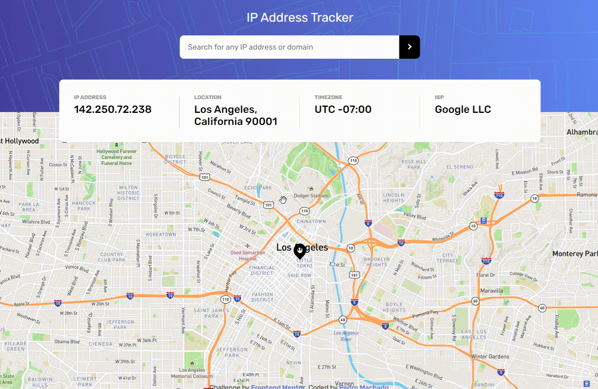
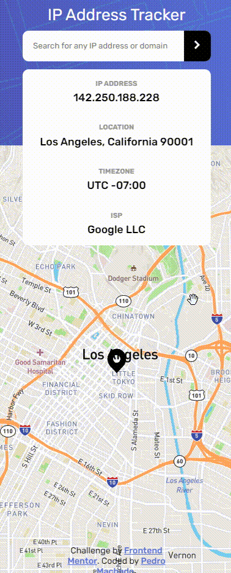

## Table of contents

- [Overview](#overview)
  - [The challenge](#the-challenge)
  - [Screenshot](#screenshot)
  - [Links](#links)
- [My process](#my-process)
  - [Built with](#built-with)
  - [What I learned](#what-i-learned)
- [Author](#author)

## Overview

### The challenge

Users should be able to:

- View the optimal layout for each page depending on their device's screen size
- See hover states for all interactive elements on the page
- See their own IP address on the map on the initial page load
- Search for any IP addresses or domains and see the key information and location

### Website

### Links

- Solution URL: [Add solution URL here](https://your-solution-url.com)
- Live Site URL: [https://phmac7-iptracker.netlify.app/](https://phmac7-iptracker.netlify.app/)

## My process

### Built with

- HTML5
- CSS3
- Javascript
- Axios
- GeoIpFy API
- Leaflet Library

### What I learned

How to create and customize the map from LeafLet Library.

## Author

- Website - [Pedro Machado](github.com/phmac7)
- Frontend Mentor - [@phmac7](https://www.frontendmentor.io/profile/phmac7)

